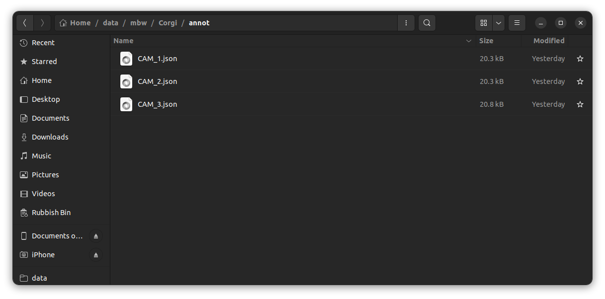

AnyTrack: Track any features
============

Track anything with minimal annotations using multiple views (synchronized video).

<p align="center">
  
</p>

Based on [MBW: Multiview Bootstrapping in the Wild (NeurIPS 2022)](https://arxiv.org/abs/2210.01721). Citation details are at the end of this read-me.

AnyTrack provides a powerful way of generating labeled data in the wild at scale. Thereby, it democratizes the domain of data collection to a plethora of machine learning-driven computer vision applications via its novel self-supervision technique. 

&nbsp;
Table of contents
=================

<!--ts-->
   * [Setup](#setup)
   * [Unit tests](#unit-tests)
   * [Demos](#demos)
   * [Create a custom dataset](#create-a-custom-dataset)
   * [Training (Generate labels from AnyTrack)](#training-generate-labels-from-anytrack)
   * [Evaluation and visualization](#evaluation-and-visualization)
   
<!--te-->


Setup
============
1. To install libmamba(A Faster Solver for Conda) and set the new solver, run the following commands: 
    ```
    conda update -n base conda
    conda install -n base conda-libmamba-solver
    conda config --set solver libmamba
    ```
    If you are new to `conda`` package and environment management, please visit

    https://conda.io/projects/conda/en/latest/user-guide/getting-started.html

2. Create conda environment and activate it:
    ```
    conda env create -f environment_gpu.yml
    conda activate anytrack
    ```
3. Fetch the pre-trained flow and detector models from Google Cloud using:

    ```
    gcloud storage cp gs://aiml-shop-anytrack-data/models.zip .
    unzip models.zip
    rm -rf models.zip && rm -rf md5sums.txt
    ```

4. Download the data and unzip it in the `data` directory. 

   This project makes use of the Google Cloud CLI (Command Line Interface)

   To familiarise yourself with this tool please visit: https://cloud.google.com/sdk/docs/install-sdk
   ```
   gcloud storage cp gs://aiml-shop-anytrack-data/data.zip .
   unzip data.zip
   rm -rf data.zip
   ```
   The final directory after retrieving pre-trained models and sample data should look like this:
   ```
   ${anytrack}
    `-- data
        `-- Chimpanzee
            |-- annot/
            |-- images/
        `-- Clownfish
            |-- annot/
            |-- images/
        `-- Colobus_Monkey
            |-- annot/
            |-- images/
        `-- Fish
            |-- annot/
            |-- images/
        `-- Seahorse
            |-- annot/
            |-- images/
        `-- Tiger
            |-- annot/
            |-- images/
    `-- models
        |-- detector/
        |-- flow/
        |-- mvnrsfm/
    ```

&nbsp;


Unit tests
============

    ./scripts/unit_tests.sh


Training (Generate labels from AnyTrack)
============

    ./scripts/train.sh

Note: The scripts need to have views folder named as `CAM_1, CAM_2, ...`.

Evaluation and visualization
============
    ./scripts/eval.sh
    ./scripts/visualize.sh    

Demos
============
1. Follow along [tutorial.ipynb](tutorial.ipynb) for a tutorial starting from how to capture videos from multiple views of a robot dog to training and visualizing the labels.

2. Please run [visualize_demo.ipynb](visualize_demo.ipynb) to play around and see visualizations of labels in the provided Jupyter notebook. We provide tools to visualize the 2D predictions (along with a confidence flag of `Accept` or `Reject`). The reconstructed 3D could also be visualized via an interactive plotly visualization tool.

```
jupyter notebook --ip 0.0.0.0 --no-browser
```

Note: Notebooks must be run in the respective python environment described in [Setup](#setup).


Create a custom dataset
============

1.   Create a  json file as shown below in ``configs/joints/Corgi.json``


```
{
"num_joints": 3,
"joint_connections": [
    [0, 2],
    [1, 2],
    [0, 1]
],
"joints_name": ["left_ear", "right_ear", "nose"],
"range_scale": 1,
"R": [
    [1.0, 0.0, 0.0],
    [0.0, 1.0, 0.0],
    [0.0, 0.0, 1.0]
]
}
```

* The `joints_connections` are a line drawn between a number of indecies for verticies of a keypoint detector as listed in ``joints_name`` so in this example ``left_ear`` is the first (index 0) joint and ``nose`` is the last (index 2) joint.

* The first ``joint_connection`` is from ``left_ear`` (index 0) to ``nose`` (index 2).

* The ``R`` is the rotation (and scale) component of a 4x4 tranformation matrix, used by the visualisation as ``rigid_rotation`` with its value as identity it has no effect

* We can see in this example we have three joints as indicated by ``num_joints``

* By chance we have three ``joint_connections`` by counting the length of this list, but this list could be anything typically to draw a skeleton of a articulated animal or equipment.

* The joint connections could be soft tissue like the clown fish example.


1. Create a datset of frames extracted from multi view synced videos of an object. Check this [tutorial](tutorial.ipynb) on how to create a custom dataset.
    ```
    -- Corgi
            |-- CAM_1/
                |-- 0001.jpg
                |-- 0002.jpg
                |-- 0003.jpg
                ..
            |-- CAM_2/
                |-- 0001.jpg
                |-- 0002.jpg
                |-- 0003.jpg
                ..
            |-- CAM_3/
                |-- 0001.jpg
                |-- 0002.jpg
                |-- 0003.jpg
                ..
    ```
2.    Now we need to pick images from this dataset to annotate. Run the below command to generate a folder called ``ann_images`` containing images to be annotated.

```
python scripts/create_dataset.py --data /home/data/corgi_filtered --name Corgi --percent 2
```

This will create a ``data/Corgi`` folder.
    

3.  Now annotate each view in folder ``data/Corgi/ann_images`` seperately in a annotation tool: ``Label Studio`` . The labels should be same as ``joints_name`` defined few steps above. 

    Export annotated data in ``JSON-MIN`` format and then rename it to match view name. 

4.  Copy the json files to ``Corgi/annot``

    


5.  To visualize the annotated images run, 
    >``Note:`` You need to install [Voxel FiftyOne](https://docs.voxel51.com/getting_started/install.html) for this step.

    ```
    python scripts/visualize.py --images data/Corgi/images/CAM_1 --annot data/Corgi/annot/CAM_1.json

    ```
    


6.  Now to make pickle files run, 

    ```
    python scripts/create_pckl.py --data path/to/data --joints configs/joints/Corgi.json --name Corgi

    ```

    ``--data`` path to data folder created in above steps

    `` --name`` name of dataset

    ``--joints`` path to the JSON file with joint information

This will create ``pkl`` files required to train the dataset. 

7. Run the below command to test if we have everything

```
python common/preprocess.py --dataset Corgi --percentage_if_gt 10 --host localhost --port 8080
```

8. Train the model on the dataset
```
source ./scripts/train.sh
```

&nbsp;


### Citation
If you use our code, dataset, or models in your research, please cite with:
```

@inproceedings{dabhi2022mbw,
	title={MBW: Multi-view Bootstrapping in the Wild},
	author={Dabhi, Mosam and Wang, Chaoyang and Clifford, Tim and Jeni, Laszlo and Fasel, Ian and Lucey, Simon},
	booktitle={Thirty-sixth Conference on Neural Information Processing Systems Datasets and Benchmarks Track},
	year={2022},
	ee = {https://openreview.net/forum?id=i1bFPSw42W0},
	organization={NeurIPS}
}


@inproceedings{dabhi2021mvnrsfm,
	title={High Fidelity 3D Reconstructions with Limited Physical Views},
	author={Dabhi, Mosam and Wang, Chaoyang and Saluja, Kunal and Jeni, Laszlo and Fasel, Ian and Lucey, Simon},
	booktitle={2021 International Conference on 3D Vision (3DV)},
	year={2021},
	ee = {https://ieeexplore.ieee.org/abstract/document/9665845},
	organization={IEEE}
}

```

### Licensing

AnyTrack is available for non-commercial internal research use by academic institutions or not-for-profit organisations only, free of charge. Please, see the [license](LICENSE) for further details. To the extent permitted by applicable law, your use is at your own risk and our liability is limited. Interested in a commercial license? For commercial queries, please email <aimlshop@adelaide.edu.au> with subject line "AnyTrack Commercial License".

This is an [AIML Shop](https://shop.aiml.team) project.
